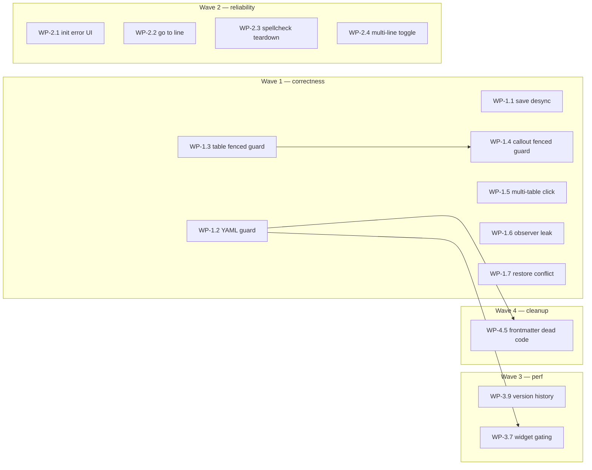

# Markdown Viewer Health — Implementation Plan

> Derived from [REVIEW-markdown-viewer-health-2026-08-15.md](./REVIEW-markdown-viewer-health-2026-08-15.md).
> Last updated: 2026-08-15

## How to use this plan

Each **work package** below is sized to become one [idea-lab](../ideas/) file (`2-to-plan` → `3-to-implement` → `4-to-qa`). Suggested slugs are listed so you can promote any package independently without re-scoping.

**Verification baseline for every package:** `npm run compile` (0 type/lint errors) + manual F5 smoke test in Extension Development Host. Host-side changes have no automated tests; CM6 modules may have co-located `*.test.mts` — extend those where noted.

**Recommended delivery order:** Wave 1 → Wave 2 → Wave 3. Within a wave, packages are independent unless a dependency is called out.

---

## Wave 1 — Correctness / data loss (do first)

These five match the review's "if I could only do 5 things" list, plus the multi-table click bug as a close runner-up.

### WP-1.1 — Save-completion `originalContent` desync

| | |
|---|---|
| **Review ref** | §1.1 |
| **Severity / effort** | L (data loss) / S |
| **Suggested slug** | `fix-save-original-content-desync` |
| **Primary files** | `src/webviews/md/mdWebview.ts` |

**Problem:** On `saveResult`, `originalContent` is set from live `currentContent`, not the text actually written. Edits during an in-flight save are marked clean and never persisted.

**Implementation:**
1. In `doSave()`, capture the exact payload string sent (e.g. `pendingSaveContent`) before `postMessage({ command: 'saveMarkdown', ... })`.
2. On successful `saveResult`, set `originalContent = pendingSaveContent` (then clear the pending value).
3. On failed/conflict `saveResult`, leave `originalContent` unchanged; ensure dirty state stays true.
4. Optional hardening: skip updating `currentContent` baseline in `onDocChanged` while `isSaving` is true (review mentions no guard today) — only if needed after step 1–2; prefer minimal fix first.
5. Update [.docs/dev/MESSAGE-PROTOCOL.md](./MESSAGE-PROTOCOL.md) only if message shape changes (should not).

**QA:**
- Type continuously through autosave pause; confirm all keystrokes survive reload.
- Type during manual Save; confirm dirty indicator reappears if edits continued after send.
- Conflict path still shows overwrite prompt; no false-clean state.

**Tests:** None required for host; consider a small unit test on dirty-check logic if extracted.

---

### WP-1.2 — Circular YAML frontmatter crash

| | |
|---|---|
| **Review ref** | §1.2 |
| **Severity / effort** | H (CM6 pipeline crash) / S |
| **Suggested slug** | `guard-frontmatter-circular-yaml` |
| **Primary files** | `src/webviews/md/frontmatter.ts`, `src/webviews/md/livePreview/frontmatterWidget.ts` |

**Problem:** `flattenFieldRows` recurses into circular `js-yaml` output with no guard; throw inside `frontmatterWidgetField` drops all decorations.

**Implementation:**
1. Add depth cap and/or `WeakSet` visited-guard in `flattenFieldRows` / `buildFieldRows`.
2. Wrap `resolveFrontmatterWidgetData` call in `frontmatterWidgetField` with try/catch; on failure return empty decorations (same UX as parse failure).
3. Add unit test in `frontmatter.test.mts` with anchor/alias self-reference (`a: &x\n  b: *x`).

**QA:** Open/create `.md` with circular YAML frontmatter; live preview must not blank; card shows graceful fallback.

---

### WP-1.3 — Fenced-code guard for table boundary editing

| | |
|---|---|
| **Review ref** | §1.3 |
| **Severity / effort** | M (data loss via backspace) / M |
| **Suggested slug** | `table-boundary-skip-fenced-code` |
| **Primary files** | `src/webviews/md/livePreview/tableBoundaryEditing.ts`, reference `codeStyling.ts` |

**Problem:** Regex fallback treats pipe lines inside fenced code as real tables; arrow nav hijacked; backspace can delete code via `deleteTableSpec`.

**Implementation:**
1. Read `shouldSkipFencedCode` (or equivalent syntax-tree ancestor check) from `codeStyling.ts`.
2. In `resolveTableAtLine` / regex fallback path, bail if line is inside `FencedCode` / `CodeText`.
3. Ensure `isTableRowLine` / `tableBlockRangeForLine` are not used without tree guard when fabricating grids.
4. Add unit tests with a fenced block containing `| a | b |` markdown example.

**QA (manual F5):** Fenced pipe-table example; arrows at edges stay in code; backspace does not invoke table delete.

---

### WP-1.4 — Fenced-code guard for callout fence detection

| | |
|---|---|
| **Review ref** | §1.4 |
| **Severity / effort** | M (rendering corruption) / M |
| **Suggested slug** | `callout-fence-skip-fenced-code` |
| **Primary files** | `src/webviews/md/livePreview/calloutTypes.ts`, `calloutDecorations.ts`, `calloutWidget.ts` |

**Problem:** `findCalloutBlocks` regex-scans `:::` lines without syntax-tree check.

**Implementation:**
1. Share a small helper (extract from `codeStyling.ts` or `mermaidDetection.ts` pattern) — `lineIsInsideFencedCode(state, lineNumber)`.
2. Filter callout candidates in `findCalloutBlocks` before open/close pairing.
3. Unit test: fenced block containing example `:::note` syntax must not get callout widgets.

**QA:** Doc with callout examples inside a code fence — no dimming, no type-select widget in code.

**Bundle note:** WP-1.3 and WP-1.4 share one helper; implement helper in WP-1.3, consume in WP-1.4, or do both in one idea file `fenced-code-guards-table-callout`.

---

### WP-1.5 — Multi-table stale cell positions on plain click

| | |
|---|---|
| **Review ref** | §1.5 |
| **Severity / effort** | M / S–M |
| **Suggested slug** | `table-widget-stale-cell-positions` |
| **Primary files** | `src/webviews/md/livePreview/tableWidget.ts` |

**Problem:** `TableWidget.eq()` preserves instance when metadata unchanged; cached grid offsets go stale after edits to an earlier table.

**Implementation:**
1. In plain-click handler (~1571–1588), re-resolve `tableNode` + grid from `view.state` at click time (mirror context-menu path ~already correct).
2. Apply same pattern to drag-close paths if they use cached offsets.
3. Add `tableWidget.test.mts` case: two tables, edit table 1, click cell in table 2 — selection lands correctly.

**QA (manual F5):** Two tables, edit first, click untouched cell in second — cursor correct, no `RangeError`.

---

### WP-1.6 — Table widget observer leak

| | |
|---|---|
| **Review ref** | §1.6 |
| **Severity / effort** | M–L (session leak) / S |
| **Suggested slug** | `table-widget-observer-cleanup` |
| **Primary files** | `src/webviews/md/livePreview/tableWidget.ts` |

**Problem:** `wireTableScrollUI` creates `ResizeObserver` + `MutationObserver` per `toDOM()` with no disconnect.

**Implementation:**
1. Store observer handles on wrapper element or instance fields.
2. Override `destroy(dom)` on `TableWidget` to disconnect both.
3. Before creating new observers in `toDOM`, disconnect any previous pair for that DOM subtree.

**QA:** Long session with heavy table cell navigation; DevTools Performance/Memory — observer count should not grow unbounded (spot-check).

---

### WP-1.7 — `restoreVersion` conflict check

| | |
|---|---|
| **Review ref** | §1.7 |
| **Severity / effort** | M / S |
| **Suggested slug** | `restore-version-conflict-check` |
| **Primary files** | `src/mdEditorProvider.ts` |

**Problem:** `restoreVersion` writes without fresh-disk read; external edits silently clobbered.

**Implementation:**
1. Before `writeFile`, re-read disk (same pattern as `saveMarkdown` ~274–281).
2. If disk differs from editor's known baseline, post conflict message to webview (reuse `saveConflict` flow or parallel `restoreConflict`).
3. Wire webview handler if new message; update MESSAGE-PROTOCOL.md.

**QA:** Change file on disk externally, open version picker, Restore — must warn, not overwrite silently.

---

## Wave 2 — Reliability & UX gaps

### WP-2.1 — `webviewReady` read failure stuck loading

| **Review ref** | §1.8 | **Effort** | S |
| **Files** | `src/mdEditorProvider.ts`, possibly `mdWebview.ts` |
| **Slug** | `webview-ready-read-error-ui` |

Post `reloadFromDiskError` (or `initFailed`) from catch at ~191–193; webview shows in-tab error + retry like reload path.

---

### WP-2.2 — Go to Line (`window.prompt` blocked)

| **Review ref** | §1.9 | **Effort** | S |
| **Files** | `formatCommands.ts`, toolbar wiring in `mdWebview.ts` |
| **Slug** | `go-to-line-in-webview-modal` |

Replace `window.prompt` with in-webview input modal (match existing confirm patterns). Bind `Mod-g` and toolbar button.

---

### WP-2.3 — Spellcheck teardown on unmount

| **Review ref** | §1.10 | **Effort** | S |
| **Files** | `spellcheck.ts`, `livePreviewEditor.ts` or unmount path |
| **Slug** | `spellcheck-unmount-cleanup` |

Export teardown; call from `unmountLivePreview()` — remove menu from `document.body`, clear `activeView`, detach global listeners.

---

### WP-2.4 — Multi-line selection line-prefix toggle

| **Review ref** | §1.11 | **Effort** | M (after F5 confirm) |
| **Files** | `formatCommands.ts` (`computeToggleLinePrefix`) |
| **Slug** | `format-toggle-all-selected-lines` |

**Pre-step:** F5 verify bug (select 3+ lines, toggle list/quote). If confirmed, loop all lines in selection range instead of first line only. Add `formatCommands.test.mts` coverage.

---

### WP-2.5 — Minor race / UX items (optional batch)

| **Review ref** | §1.12 |
| **Slug** | `md-disk-sync-edge-cases` |

| Item | Approach |
|------|----------|
| Duplicate disk-change toast after manual reload | Set suppress flags in `requestFreshData` like save path; verify with F5 |
| Save read/write race / version history swap | Audit `isSaving` + `lastSaveTime` around `showVersionHistory` |
| Stale `workspaceFolders` snapshot | Refresh `localResourceRoots` on `onDidChangeWorkspaceFolders` |
| `pickCellInRow` throw on empty row | Defensive guard or assert unreachable |

Treat as one "edge cases" idea or split per finding after F5 confirms reachability.

---

## Wave 3 — Performance (quick wins)

Low risk, no behavior change expected. Good for a single "perf pass" idea or individual files.

| WP | Review | Effort | Files | Change |
|----|--------|--------|-------|--------|
| **3.1** | §3.2 | S | `mdWebview.ts` | `updateEditToolbarButtons`: compare `currentContent` vs `originalContent` directly; drop redundant `getLivePreviewContent` + sanitize on every keystroke |
| **3.2** | §3.3 | S | `mdWebview.ts` | Debounce `reapplySearch` from `onDocChanged` (same 200ms as search box) |
| **3.3** | §3.4 | S | `mdWebview.ts` | TOC resize drag: wrap `mousemove` in `throttleRAF` |
| **3.4** | §3.5 | S–M | `tableWidget.ts` | rAF-gate hover + row/column drag `mousemove`; cache rects at drag start |
| **3.5** | §3.6 | S | `headingGutterSync.ts` | Skip rebuild unless `docChanged` / `viewportChanged` |
| **3.6** | §3.7 | S | `spellcheck.ts` | Scope exclusion ranges to visible ranges |
| **3.7** | §3.9 | S–M | `calloutWidget.ts`, `frontmatterWidget.ts`, `mermaidWidget.ts` | Gate `StateField.update` on `tr.docChanged` / effects; frontmatter: `sliceString(0, N)` not full `toString()` |
| **3.8** | §3.8 | M | `revealDecorations.ts` | Profile first; viewport-scope ordered-marker scan if hot |
| **3.9** | §3.1 | M | `mdEditorProvider.ts` | Version history: append-only NDJSON or skip full rewrite when only appending — larger design |

**Suggested slug for 3.1–3.7 bundle:** `md-live-preview-perf-quick-wins`  
**3.9 standalone:** `version-history-append-only`

---

## Wave 4 — Simplification / dead code

Safe to defer until Waves 1–2 are done. Reduces cognitive load for future edits.

| WP | Review | Effort | Files | Action |
|----|--------|--------|-------|--------|
| **4.1** | §2.1 | S | `mdWebview.ts` | Collapse `setPreviewEditMode` → `enterPreviewEditMode()`; merge `isEditMode`/`isPreviewEditMode`; remove `preview-left` dead branch |
| **4.2** | §2.2 | S | `mdEditorProvider.ts` | Remove `previewVersionTimestamp` / `previewVersionContent` |
| **4.3** | §2.3 | S | `mdEditorProvider.ts` | Remove CDN KaTeX link (or wire local bundle if math is planned) |
| **4.4** | §2.4 | S | `mdEditorProvider.ts` | Remove dead `enableDefaultEditor` case |
| **4.5** | §2.5–2.7 | L | `frontmatter.ts`, tests | Delete unused `sourceLine`, per-field edit path, `resolveFrontmatterForRender`; fold tests into widget-data tests |
| **4.6** | §2.8 | S | `spellcheck.ts`, `spellcheckExclusions.ts` | Deduplicate `overlaps()` |
| **4.7** | §2.9 | S | `revealDecorations.ts` | Module-scope `dimMark` / `hiddenMark` singletons |

**Suggested slug for host/shell cleanup:** `md-dead-scaffolding-cleanup`  
**Frontmatter cleanup:** `frontmatter-dead-code-removal` (do after WP-1.2 so guards stay in the code you keep)

---

## Dependency graph



---

## Suggested idea-file breakdown

| Priority | Idea file slug | Packages | Est. size |
|----------|----------------|----------|-----------|
| P0 | `fix-save-original-content-desync` | WP-1.1 | 1 PR |
| P0 | `guard-frontmatter-circular-yaml` | WP-1.2 | 1 PR |
| P0 | `fenced-code-guards-table-callout` | WP-1.3 + WP-1.4 | 1 PR (shared helper) |
| P0 | `table-widget-stale-cell-positions` | WP-1.5 | 1 PR |
| P0 | `table-widget-observer-cleanup` | WP-1.6 | 1 PR (can merge with 1.5 if touching same file) |
| P0 | `restore-version-conflict-check` | WP-1.7 | 1 PR |
| P1 | `md-host-init-and-restore-ux` | WP-2.1 + WP-2.2 | 1–2 PRs |
| P1 | `spellcheck-unmount-cleanup` | WP-2.3 + WP-4.6 | 1 PR |
| P1 | `format-toggle-all-selected-lines` | WP-2.4 | 1 PR after verify |
| P2 | `md-live-preview-perf-quick-wins` | WP-3.1–3.7 | 1–2 PRs |
| P2 | `version-history-append-only` | WP-3.9 | 1 PR (design first) |
| P3 | `md-dead-scaffolding-cleanup` | WP-4.1–4.4, 4.7 | 1 PR |
| P3 | `frontmatter-dead-code-removal` | WP-4.5 | 1 PR after WP-1.2 |

**Total:** ~12 idea files, ~10–14 PRs if table widget and host UX items are split for reviewability.

---

## Per-package checklist (copy into each idea file `## Plan`)

```markdown
- [ ] Read review section + cited lines in full
- [ ] Implementation steps (from this plan)
- [ ] `npm run compile`
- [ ] Unit tests added/updated (if applicable)
- [ ] MESSAGE-PROTOCOL.md updated (if messages change)
- [ ] Manual F5 QA steps executed
- [ ] CHANGELOG.md entry (user-visible fixes only)
```

---

## What we're explicitly not doing in this pass

- Renaming `xlsxViewer.*` / `xlsx-viewer.*` IDs
- CSP / `localResourceRoots` restructuring (except removing CDN KaTeX in WP-4.3)
- esbuild output path changes
- Spreadsheet code
- New features (math rendering, frontmatter click-to-jump) — only listed as dead-code removal or CDN cleanup

---

## Next step

Pick a starting package (recommend **WP-1.1** or bundle **WP-1.3 + WP-1.4**). Say which slug(s) to promote to `.docs/ideas/2-to-plan/` and we can run idea-lab Phase 3 (detailed plan per file) or jump straight to `3-to-implement`.
