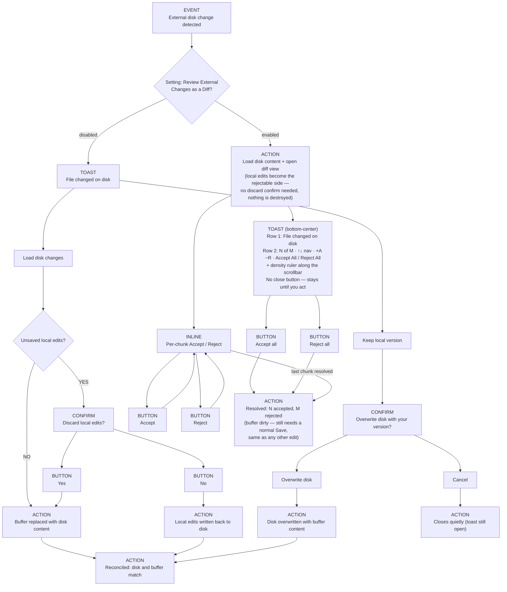

Setting: **Review External Changes as a Diff** (default: off — opt in from the Settings menu). Enabled, the diff opens automatically — the right-hand branch above. Off (the default), only the two-button toast on the left exists, each option with its own discard/overwrite confirm, since neither is undo-able through a diff.

Accept All / Reject All are also reachable without the mouse: Command Palette → "Sheetmark: Accept/Reject All Disk Changes", or `Ctrl+Alt+Y` / `Ctrl+Alt+N` (`Cmd+Alt+Y/N` on macOS) while a Sheetmark Markdown editor is focused.
