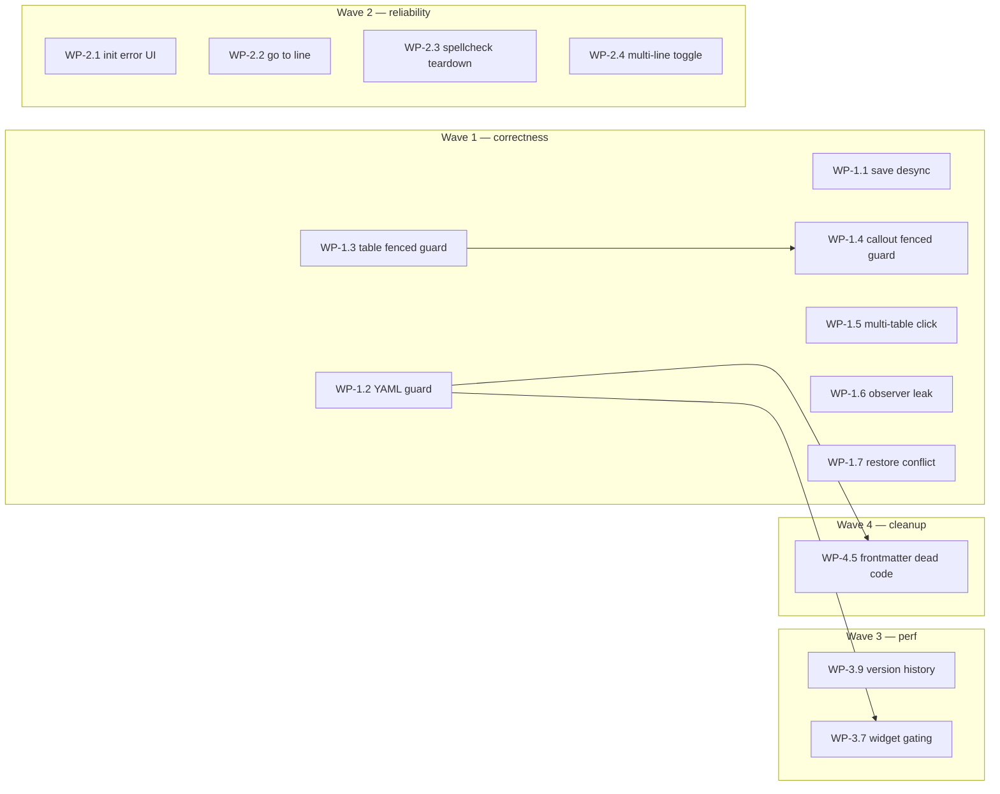

# Markdown viewer health (correctness, reliability, perf, cleanup)

## Idea

Technical health review and fix pass on the markdown viewer (`mdEditorProvider.ts`,
`mdWebview.ts`, `livePreview/**`, `frontmatter.ts`, `frontmatterCardUi.ts`).
Address silent data-loss paths, crash risks, reliability gaps, performance quick wins,
and dead-code cleanup. Spreadsheet code excluded.

## Brainstorm

Scope: `src/mdEditorProvider.ts`, `src/webviews/md/mdWebview.ts`, `src/webviews/md/livePreview/**`,
`src/webviews/md/frontmatter.ts`, `src/webviews/md/frontmatterCardUi.ts`. Spreadsheet code excluded.
Review-only — no source files were modified. Findings below were produced by five focused passes
(host provider; webview shell; CM6 core engine; CM6 widgets; frontmatter + full protocol audit),
each reading its files in full and citing real line numbers.

## Summary

The markdown viewer is in reasonable shape overall: the host↔webview message protocol was
audited command-by-command across both directions and **no mismatches were found** — every sender
has a matching handler and payload field names line up everywhere. The legacy split/contentEditable
preview path is confirmed gone in substance (only harmless scaffolding remains). The real risk is
concentrated in three places: (1) a silent data-loss bug in the webview's dirty-tracking around
save completion, (2) an uncaught-exception path in frontmatter parsing that can crash the whole CM6
decoration pipeline on a specific (rare but legal) YAML construct, and (3) a family of "line-regex
treats fenced-code examples as real blocks" bugs shared by the table-boundary-editing keymap and the
callout-fence detector, which can misfire arrow/backspace navigation and, in the worst case, delete
code content. Beyond that, most findings are either performance (unthrottled mousemove handlers,
unscoped per-keystroke rebuilds in a couple of widget StateFields, two leaked observers in the table
widget) or straightforward dead-code cleanup. Nothing here requires renaming `xlsxViewer.*`/
`xlsx-viewer.*` IDs, touching esbuild paths, or CSP/localResourceRoots restructuring.

Several findings below are flagged as **needs manual F5 verification** — this repo has no
extension-host test suite, so timing-dependent races and drag/hover jank can't be confirmed
statically; treat those as hypotheses to smoke-test, not settled bugs.

---

## 1. Correctness / bug risk

### 1.1 `originalContent` is stamped from live `currentContent`, not from what was actually saved — silent data loss
**File:** [mdWebview.ts:612-618](../../../../src/webviews/md/mdWebview.ts#L612) (`doSave`), [mdWebview.ts:419-431](../../../../src/webviews/md/mdWebview.ts#L419) (`onDocChanged`, no `isSaving` guard), [mdWebview.ts:1405-1416](../../../../src/webviews/md/mdWebview.ts#L1405) (`saveResult` handler: `originalContent = currentContent`)

`doSave()` sends the current text as `saveMarkdown`, but CM6 keeps accepting edits while the
save is in flight (the host round-trip does an `await readFile` conflict-check then
`await writeFile` — [mdEditorProvider.ts:266-294](../../../../src/mdEditorProvider.ts#L266)). If the
user types more between the send and the `saveResult` reply, the handler sets
`originalContent = currentContent` — the *newer* value, not the text that was actually written to
disk. `isEditorDirty()` then reports clean and autosave's dirty check also short-circuits, so the
extra keystrokes are never persisted and no dirty indicator warns the user.

**Why it matters:** silent data loss on an everyday timing window (type while a save/autosave is
in flight), with no error surfaced. This directly violates the "currentContent is the single source
of truth" contract's intent.

**Suggested direction:** capture the exact text sent in `doSave` (e.g. `pendingSaveContent`) and on
successful `saveResult` set `originalContent` from that captured value, not from live `currentContent`.

**Severity/Effort:** L / S.

---

### 1.2 Frontmatter parsing crashes on self-referential YAML — uncaught throw inside a CM6 StateField
**File:** [frontmatter.ts:107-163](../../../../src/webviews/md/frontmatter.ts#L107) (`flattenFieldRows`/`buildFieldRows`), consumed unguarded by [frontmatterWidget.ts:99-101](../../../../src/webviews/md/livePreview/frontmatterWidget.ts#L99) inside `frontmatterWidgetField`'s `create`/`update`

A legal one-line YAML anchor/alias self-reference (`a: &x\n  b: *x`) makes `js-yaml`'s `load()`
return a circular object (verified — `js-yaml` doesn't reject this). `flattenFieldRows` recurses
into `Object.entries(value)` with no visited-set or depth cap, so it recurses forever and throws
`RangeError: Maximum call stack size exceeded`. This happens in `resolveFrontmatterWidgetData`
([frontmatter.ts:274-289](../../../../src/webviews/md/frontmatter.ts#L274)), called directly from the
`frontmatterWidgetField` StateField with no try/catch around it — the only try/catch in the file
wraps just the `loadYaml` call inside `parseFrontmatter`
([frontmatter.ts:60-71](../../../../src/webviews/md/frontmatter.ts#L60)), not the flatten step.

**Why it matters:** this is exactly the sharp edge called out in the review brief — a throw inside
a CM6 decoration/StateField builder silently drops decorations for the *entire* plugin, not just
this widget. Any file containing this frontmatter shape (accidental copy-paste of a YAML anchor
example, or intentionally crafted) breaks live preview rendering.

**Suggested direction:** add a `WeakSet`-based visited-guard or depth cap in `flattenFieldRows`,
and/or wrap the `buildFieldRows` call sites in try/catch with the same graceful "show as plain text"
fallback already used for parse failures.

**Severity/Effort:** H / S. **High-confidence — reproduced by the reviewing agent standalone.**

---

### 1.3 Table-boundary-editing keymap treats any pipe-shaped line as a real table, including inside fenced code
**File:** [tableBoundaryEditing.ts:198-217](../../../../src/webviews/md/livePreview/tableBoundaryEditing.ts#L198) (`isTableRowLine`/`tableBlockRangeForLine`), fallback at [tableBoundaryEditing.ts:345-357](../../../../src/webviews/md/livePreview/tableBoundaryEditing.ts#L345) (`resolveTableAtLine`), delete-arm path at [tableBoundaryEditing.ts:274-282](../../../../src/webviews/md/livePreview/tableBoundaryEditing.ts#L274)

`isTableRowLine`/`tableBlockRangeForLine` are pure text-regex heuristics. `resolveTableAtLine` tries
a syntax-tree `Table` ancestor first, but **falls back** to fabricating a table grid from raw text
when no `Table` node is found — e.g. when the pipe-shaped line is actually inside a fenced code
block showing example table syntax. This is inconsistent with `tableWidget.ts`'s own decoration
path, which only renders a widget for genuine syntax-tree `Table` nodes, and with
`codeStyling.ts`'s `shouldSkipFencedCode` guard, which this file doesn't reuse.

**Why it matters:** arrow-key navigation inside a fenced code example gets hijacked into cell-to-cell
table navigation, and worse — two backspaces at the boundary can trigger `deleteTableSpec`
([tableBoundaryEditing.ts:274](../../../../src/webviews/md/livePreview/tableBoundaryEditing.ts#L274)),
actually deleting the code lines. This is a real data-loss path, not just a UX glitch, and it's
plausible content (this repo's own docs contain pipe-table examples in fenced code).

**Suggested direction:** guard the fallback with a syntax-tree check — skip if the line's ancestor
node is `FencedCode`/`CodeText`, mirroring `codeStyling.ts`'s existing `shouldSkipFencedCode` pattern.

**Severity/Effort:** M / M. **Recommend manual F5 verification:** put a pipe-table example inside a
fenced code block, press Backspace/arrows at its edges.

---

### 1.4 Callout fence detection has the same fenced-code blind spot
**File:** [calloutTypes.ts:82-118](../../../../src/webviews/md/livePreview/calloutTypes.ts#L82) (`findCalloutBlocks`), consumed by [calloutDecorations.ts:59-97](../../../../src/webviews/md/livePreview/calloutDecorations.ts#L59) and [calloutWidget.ts:90-101](../../../../src/webviews/md/livePreview/calloutWidget.ts#L90)

Same bug class as 1.3: `findCalloutBlocks` scans raw lines for `:::` fences with regex only, no
syntax-tree check — unlike `mermaidDetection.ts`, which correctly requires a lezer `FencedCode`
node. A markdown doc showing example callout syntax inside a code fence gets its `:::` lines
dimmed/hidden and a live type-select widget injected into the code sample.

**Why it matters:** lower blast radius than 1.3 (no delete-arm path here), but it's rendering
corruption of legitimate content, and worth fixing together with 1.3 since the fix pattern is
identical (reuse `shouldSkipFencedCode`-style guard).

**Suggested direction:** same as 1.3, applied per-line before treating a line as an open/close fence.

**Severity/Effort:** M / M.

---

### 1.5 Stale absolute cell positions survive across `eq()`-preserved table widget instances
**File:** [tableWidget.ts:1551-1557](../../../../src/webviews/md/livePreview/tableWidget.ts#L1551) (`TableWidget.eq()`), click handling at [tableWidget.ts:1571-1588](../../../../src/webviews/md/livePreview/tableWidget.ts#L1571)

`eq()` compares `source`/`activeCell`/`widths`/`deleteArmed`, not absolute document positions. When
it returns `true`, CM6 keeps the old JS `TableWidget` instance — including `this.grid` and cached
cell ranges whose offsets were captured at the last `toDOM()`. With two tables in one document,
editing table 1 shifts table 2's real document offsets, but table 2's widget/grid is never rebuilt
(its own inputs didn't change), so the plain-click handler on an inactive cell in table 2 dispatches
a selection at a now-stale offset. Note: the context-menu path already re-resolves `tableNode`/`grid`
fresh from `view.state` at click time — the plain-click/drag-close paths don't follow that pattern.

**Why it matters:** multi-table documents are an everyday case, not exotic; the failure is either a
silently misplaced cursor or (if the doc shrank enough) a CM6 `RangeError`. No test exists for this
(`tableWidget.test.mts` has no multi-table positional-drift case).

**Suggested direction:** re-derive the clicked cell's position from current `view.state` at click
time, same as the context-menu handler already does, instead of trusting the widget-captured grid.

**Severity/Effort:** M / S-M. **Recommend manual F5 verification:** two tables in one doc, edit
table 1, click an untouched cell in table 2.

---

### 1.6 `ResizeObserver`/`MutationObserver` leak on every table widget rebuild
**File:** [tableWidget.ts:1006-1030](../../../../src/webviews/md/livePreview/tableWidget.ts#L1006) (`wireTableScrollUI`), called from [tableWidget.ts:1611](../../../../src/webviews/md/livePreview/tableWidget.ts#L1611)

Each call creates a `new ResizeObserver(update)` and `new MutationObserver(update)` with no
`.disconnect()` and no `TableWidget.destroy()` override to clean them up. `toDOM()` reruns on every
cell-to-cell navigation (any `activeCell` change fails `eq()`) and every structural row/column edit
— each rebuild leaks a fresh observer pair watching now-detached DOM.

**Why it matters:** given `retainContextWhenHidden: true`, this accumulates over a long single-tab
editing session — exactly the "growing caches/observers never pruned" risk called out in the brief.

**Suggested direction:** add a `destroy(dom)` override on `TableWidget` that disconnects both
observers (track them via a `WeakMap` keyed on the wrapper element, or attach handles on the DOM
node for `destroy` to read).

**Severity/Effort:** M-L / S.

---

### 1.7 `restoreVersion` writes to disk with no conflict check, unlike `saveMarkdown`
**File:** [mdEditorProvider.ts:410-451](../../../../src/mdEditorProvider.ts#L410) (write at :428), contrast [mdEditorProvider.ts:266-294](../../../../src/mdEditorProvider.ts#L266) (`saveMarkdown`'s fresh-read comparison at :274-281)

`saveMarkdown` re-reads disk and bails with `saveConflict` if it changed since the in-memory
snapshot. `restoreVersion` performs the same kind of write but has no equivalent check — it blindly
overwrites current disk content with a historical snapshot.

**Why it matters:** an external change landing between opening the version picker and clicking
Restore is silently clobbered with no warning — the exact race `saveMarkdown`'s guard exists to
prevent, just not applied to its sibling write path.

**Suggested direction:** apply the same fresh-disk-read comparison (or at minimum a confirmation)
before the `writeFile` in `restoreVersion`.

**Severity/Effort:** M / S.

---

### 1.8 `webviewReady` read failure leaves the webview stuck on the loading screen forever
**File:** [mdEditorProvider.ts:172-194](../../../../src/mdEditorProvider.ts#L172), catch at :191-193

If the initial `fs.promises.readFile` throws (file deleted before boot, permission error), the
catch only shows a native VS Code toast — it never posts anything to the webview, and only
`initMarkdown` hides the loading overlay. Contrast `requestFreshData`'s catch
([mdEditorProvider.ts:257-262](../../../../src/mdEditorProvider.ts#L257)), which correctly posts
`reloadFromDiskError` for the identical failure mode.

**Why it matters:** user sees a permanently frozen tab with no in-webview error or retry affordance.

**Suggested direction:** reuse `reloadFromDiskError` (or a dedicated init-failed message) on this
catch path too.

**Severity/Effort:** M / S.

---

### 1.9 `formatCommands.ts` "Go to Line" is a dead feature — `window.prompt()` is sandbox-blocked
**File:** [formatCommands.ts:694](../../../../src/webviews/md/livePreview/formatCommands.ts#L694)

Uses `window.prompt()`, which `mdWebview.ts:662` already documents as silently blocked by the
webview sandbox (no `allow-modals`). Reachable via `Mod-g` and a toolbar button — both are dead
clicks today.

**Why it matters:** shipped, discoverable, non-functional feature; low risk but confusing to users
who try it.

**Suggested direction:** replace with an in-webview modal/input (matching the pattern used
elsewhere for confirms), or remove the binding/button until one exists.

**Severity/Effort:** L (UX) / S. **Confirmed**, not speculative — the blocking behavior is
self-documented in this codebase.

---

### 1.10 `spellcheck.ts` context menu and module-level `activeView` aren't torn down
**File:** [spellcheck.ts:128](../../../../src/webviews/md/livePreview/spellcheck.ts#L128) (menu attached to `document.body`, global listeners; module-level `activeView`)

Not cleaned up by `unmountLivePreview()`. Under `retainContextWhenHidden: true`, this risks stale
`activeView` references and leaked global listeners across tab switches.

**Suggested direction:** tear down the menu/listeners and clear `activeView` from the same unmount
path other CM6 subsystems use.

**Severity/Effort:** M / S.

---

### 1.11 `formatCommands.ts` line-prefix toggle only touches the first line of a multi-line selection
**File:** [formatCommands.ts:62](../../../../src/webviews/md/livePreview/formatCommands.ts#L62) (`computeToggleLinePrefix`)

Backs list/heading/blockquote/checkbox toolbar actions. On a multi-line selection it appears to
prefix only the first line, not each line — needs manual confirmation (reviewer flagged
medium-confidence, not reproduced end-to-end).

**Severity/Effort:** M / M. **Needs manual F5 verification:** select 3+ lines, toggle a list/quote
format, confirm all lines get the prefix.

---

### 1.12 Minor / low-confidence items worth a look but not urgent
- **[mdWebview.ts:1310-1364](../../../../src/webviews/md/mdWebview.ts#L1310) / [mdEditorProvider.ts:252-263](../../../../src/mdEditorProvider.ts#L252)** — possible duplicate "file changed on disk" toast after a manual reload, since `requestFreshData` doesn't set `isSaving`/`lastSaveTime` to suppress the independent file watcher. UX-only, unconfirmed. S-M / M. **Needs F5 verification.**
- **[mdEditorProvider.ts:266-294](../../../../src/mdEditorProvider.ts#L266) & [mdEditorProvider.ts:371](../../../../src/mdEditorProvider.ts#L371)** — narrow race window between the fresh-disk read and `isSaving = true`; `showVersionHistory` swaps `currentContent` without any `isSaving` check at all. Code already shows awareness of this class of race elsewhere; real-world reachability unconfirmed. S-M / M-L. **Needs F5 timing test.**
- **[mdEditorProvider.ts:58](../../../../src/mdEditorProvider.ts#L58)** — `workspaceFolders` snapshotted once; if folders change mid-session, local image `localResourceRoots` go stale until the tab is reopened. S / S-M.
- **[tableBoundaryEditing.ts:392](../../../../src/webviews/md/livePreview/tableBoundaryEditing.ts#L392)** — `pickCellInRow` throws on an empty grid row; looks unreachable today given how grids are built, but it's inside a `Prec.highest` keymap handler, not a decoration builder, so if ever reachable it would swallow one arrow-keypress rather than break the whole plugin. S / S.

---

## 2. Simplification

### 2.1 Dead scaffolding from the removed split/preview-toggle mode
**File:** [mdWebview.ts:380-471](../../../../src/webviews/md/mdWebview.ts#L380) (`setPreviewEditMode`) — only ever called with `true` (call sites at :536, :1397); the `!enabled` branches throughout are unreachable. `isEditMode`/`isPreviewEditMode` ([mdWebview.ts:57-58](../../../../src/webviews/md/mdWebview.ts#L57)) are always set identically together — fully redundant. Stale comment at :645-646 references a "split-textarea branch" that no longer exists in `applyReloadedContent`. Dead `preview-left` class toggle at :414 has no matching CSS anywhere.

**Suggested direction:** collapse to a parameterless `enterPreviewEditMode()`, merge the two flags, delete the stale comment and `preview-left` remnant.

**Severity/Effort:** S / S.

### 2.2 Dead state: `previewVersionTimestamp`/`previewVersionContent` written but never read
**File:** [mdEditorProvider.ts:76-77](../../../../src/mdEditorProvider.ts#L76), assigned at :368-370, :395-397, :431-433. `restoreVersion` re-fetches from the history file by id instead of using the cached content — the cache is inert. **Severity/Effort:** S / S.

### 2.3 Vestigial, version-mismatched external KaTeX stylesheet
**File:** [mdEditorProvider.ts:679](../../../../src/mdEditorProvider.ts#L679) — links `katex@0.6.0` from a CDN. `package.json` pins `katex ^0.16.45`/`markdown-it-katex ^2.0.3`, but no import of either exists anywhere under `src/webviews/**` — no math pipeline is wired up. This is also the one crack in an otherwise fully-local CSP model in this file (required opening `style-src` to `https:` broadly). **Suggested direction:** remove the link, or if math rendering is planned, serve the bundled local `katex.min.css` instead. **Severity/Effort:** S-M / S.

### 2.4 Dead `'enableDefaultEditor'` case never sent for markdown
**File:** [mdEditorProvider.ts:491-499](../../../../src/mdEditorProvider.ts#L491) — `mdWebview.ts` only ever sends `enableAsDefault`. Harmless but copy-pasted dead symmetry with the spreadsheet provider. **Severity/Effort:** S / S.

### 2.5 Frontmatter dead code and a latent bug in unused click-to-jump plumbing
**File:** [frontmatter.ts:12-20,74-89](../../../../src/webviews/md/frontmatter.ts#L12) — `sourceLine`/`yamlLineIndexForKey` are computed for every field row but nothing reads `row.sourceLine` (grepped `frontmatterCardUi.ts`/`frontmatterWidget.ts` — no click handler exists). If ever wired up, the indent-depth assumption is already wrong (hardcodes 2-space indentation; 4-space or tab-indented frontmatter falls back to line 0 for every nested field). **Suggested direction:** delete until actually used, or fix the indent assumption first. **Severity/Effort:** L-M / L.

### 2.6 Frontmatter per-field-edit code path is dead (superseded by whole-block raw-text editing)
**File:** [frontmatter.ts:190-223](../../../../src/webviews/md/frontmatter.ts#L190) (`applyRowEditsToParsed`, `setNestedValue`, `parseEditableScalar`, `formatFrontmatterBlock`) — zero production callers; only referenced from `frontmatter.test.mts`. The shipped "Edit" UI ([frontmatterCardUi.ts:100-112](../../../../src/webviews/md/frontmatterCardUi.ts#L100)) only edits the whole block as raw text via a different, simpler function. **Severity/Effort:** L / L.

### 2.7 Duplicate near-identical frontmatter render-resolution function
**File:** [frontmatter.ts:225-250](../../../../src/webviews/md/frontmatter.ts#L225) (`resolveFrontmatterForRender`) — zero production callers (test-only), near-duplicate of the actually-used `resolveFrontmatterWidgetData` ([frontmatter.ts:274-289](../../../../src/webviews/md/frontmatter.ts#L274)); looks like a leftover from the removed static-preview render path. **Suggested direction:** delete, fold any useful test coverage into the widget-data tests. **Severity/Effort:** L / L.

### 2.8 `overlaps()` duplicated verbatim between spellcheck files
**File:** [spellcheckExclusions.ts:41](../../../../src/webviews/md/livePreview/spellcheckExclusions.ts#L41) and its twin in `spellcheck.ts`. **Severity/Effort:** S / S.

### 2.9 `dimMark`/`hiddenMark` recreated per-call instead of module-scoped
**File:** [revealDecorations.ts:335](../../../../src/webviews/md/livePreview/revealDecorations.ts#L335) — inconsistent with sibling marks in the same file that are module-scoped singletons. **Severity/Effort:** S / S.

### 2.10 Version history persistence is a full read/parse/rewrite on every save settle
**File:** [mdEditorProvider.ts:90-136](../../../../src/mdEditorProvider.ts#L90) (`loadHistory`/`saveHistory`/`pruneHistory`/`persistVersionSnapshot`) — see §3.1 (grouped there since it's primarily a performance concern, but the append-only/diff-based redesign would also simplify this code).

---

## 3. Performance

### 3.1 Version history rewrites the entire history file (with full document content) on every save
**File:** [mdEditorProvider.ts:90-136](../../../../src/mdEditorProvider.ts#L90), invoked from the debounced autosave path (:287) and directly from `restoreVersion` (:435)

Each settle: read the whole history JSON, parse, filter by 48h retention, push one entry holding
the **full markdown content** (not a diff), reserialize, rewrite the entire array. With autosave on
over a long session, this is O(history-size × file-size) work repeated on essentially every pause
in typing.

**Suggested direction:** append-only storage (e.g. NDJSON) or diff-based snapshots; at minimum skip
the rewrite when nothing was pruned and only an append happened.

**Severity/Effort:** M/L (scales with usage) / M.

### 3.2 Every keystroke double-serializes the document and re-scans it, just to refresh toolbar button state
**File:** [mdWebview.ts:430](../../../../src/webviews/md/mdWebview.ts#L430) (`updateEditToolbarButtons()` called from `onDocChanged`) → [mdWebview.ts:156-158](../../../../src/webviews/md/mdWebview.ts#L156) (`isEditorDirty`) → [mdWebview.ts:522-532](../../../../src/webviews/md/mdWebview.ts#L522) (`getActiveEditorContent`) → `getLivePreviewContent()` ([livePreviewEditor.ts:287-289](../../../../src/webviews/md/livePreview/livePreviewEditor.ts#L287), a full `doc.toString()`) → `sanitizeMarkdownCopyLinkArtifacts` ([mdWebview.ts:264-275](../../../../src/webviews/md/mdWebview.ts#L264), a `split`/regex/`join` over every line)

`onDocChanged` already has the new document as a string (`doc`) and assigns it to `currentContent`
right before this call — `updateEditToolbarButtons` then independently redoes a full
materialization + full-document regex pass on the *same* content, unthrottled, every keystroke.

**Suggested direction:** compare the already-available `doc`/`currentContent` directly against
`originalContent` instead of round-tripping through CM6 again; reserve the sanitize step for actual
save/read paths.

**Severity/Effort:** M / S.

### 3.3 Un-debounced full-document search re-run on every keystroke while search overlay is open
**File:** [mdWebview.ts:428](../../../../src/webviews/md/mdWebview.ts#L428) (`reapplySearch`, called synchronously from `onDocChanged`) → [mdWebview.ts:974-990](../../../../src/webviews/md/mdWebview.ts#L974) (`doSearch`) → [livePreviewSearch.ts:53-62](../../../../src/webviews/md/livePreview/livePreviewSearch.ts#L53) (`findCm6Matches`, a full-document `SearchCursor` scan)

Typing in the *document* while the search overlay is open bypasses the 200ms debounce that
correctly gates typing in the *search box itself* ([mdWebview.ts:939-941](../../../../src/webviews/md/mdWebview.ts#L939)).

**Suggested direction:** route document-edit-triggered re-search through the same debounce.

**Severity/Effort:** M / S.

### 3.4 TOC-resize drag writes a CSS custom property on every raw `mousemove`
**File:** [mdWebview.ts:1637-1644](../../../../src/webviews/md/mdWebview.ts#L1637) — no `throttleRAF` (the file's own utility, used elsewhere for scroll) applied here. **Severity/Effort:** S / S.

### 3.5 Table hover/drag handlers force layout reads in a loop on every raw `mousemove`
**File:** helpers at [tableWidget.ts:965-998](../../../../src/webviews/md/livePreview/tableWidget.ts#L965), hover at :1092-1112, row-drag `onMove` at :1162-1180, column-drag `onMove` at :1216-1234

Each does `querySelectorAll` + `getBoundingClientRect()` (forces sync layout) in a loop over every
row/header cell, directly inside `mousemove` — no rAF gate anywhere in this file's drag/hover code,
unlike `wireTableScrollUI`'s own `update()` which at least defers via one `requestAnimationFrame`.

**Suggested direction:** gate these handlers behind an rAF (compute once per frame, not per event);
cache row/column rects at drag-start and refresh only on scroll, as the grip-position code already
does.

**Severity/Effort:** M / S-M. **Recommend manual F5 verification:** drag a row/column on a table
with 20+ rows/columns and watch for jank.

### 3.6 `headingGutterSync.ts` rebuilds via a full unbounded syntax-tree walk on every transaction
**File:** [headingGutterSync.ts:44](../../../../src/webviews/md/livePreview/headingGutterSync.ts#L44) — no `docChanged` guard or viewport scoping, unlike `revealDecorations.ts` and `livePreviewSearch.ts` in the same folder. **Severity/Effort:** M / S.

### 3.7 Spellcheck exclusion computation is unscoped while the diagnostics loop it feeds is properly viewport-scoped
**File:** [spellcheck.ts:72](../../../../src/webviews/md/livePreview/spellcheck.ts#L72) — exclusion ranges computed over the whole document even though the actual per-word diagnostics loop correctly uses `view.visibleRanges`. **Severity/Effort:** M / S.

### 3.8 Ordered-marker atomic-range decoration rescans the whole document on every cursor motion
**File:** [revealDecorations.ts:662](../../../../src/webviews/md/livePreview/revealDecorations.ts#L662) — the file's own comment acknowledges this as a deliberate tradeoff; flagging for profiling on large documents rather than as an outright bug. **Severity/Effort:** M / M.

### 3.9 Widget StateFields ignore the transaction and rebuild unconditionally every keystroke, anywhere in the document
**File:** [mermaidWidget.ts:214-220](../../../../src/webviews/md/livePreview/mermaidWidget.ts#L214), [calloutWidget.ts:103-109](../../../../src/webviews/md/livePreview/calloutWidget.ts#L103), [frontmatterWidget.ts:99-101,114-118](../../../../src/webviews/md/livePreview/frontmatterWidget.ts#L99)

All three `update(_value, tr)` implementations discard `tr` and rebuild from full state on every
transaction anywhere in the doc. `tableWidgetField` does the same but is explicitly documented as an
accepted tradeoff (tables are rare); that reasoning doesn't extend to callouts/frontmatter, which can
appear on every keystroke's rebuild path regardless of edit location. `frontmatterWidget.ts` is the
worst case: `resolveFrontmatterWidgetData(state.doc.toString())` materializes the **entire document**
into a string and runs a full `js-yaml` parse, even though frontmatter (if present) only ever
occupies the first few lines. By contrast, `imageWidgetField` ([imageWidget.ts:271-278](../../../../src/webviews/md/livePreview/imageWidget.ts#L271)) and `codeStylingPlugin` correctly gate on
`docChanged`/`viewportChanged`/explicit effects — the right template to copy.

**Suggested direction:** gate callout/frontmatter rebuilds the same way `imageWidgetField` does;
additionally, since frontmatter always starts at offset 0, use `state.doc.sliceString(0, N)` with a
generous bound instead of materializing the whole document.

**Severity/Effort:** M / S-M (low real-world urgency today since frontmatter blocks are small and
documents in this workflow are typically modest, but the frontmatter full-doc-string cost scales
badly for large files and is a one-line-ish fix).

### 3.10 `yamlLineIndexForKey` re-splits the document text on every call
**File:** [frontmatter.ts:74-84](../../../../src/webviews/md/frontmatter.ts#L74) — called once per field row inside `flattenFieldRows`, each call re-splitting the same YAML text. Trivial fix: split once and thread the array down. **Severity/Effort:** L / S. (Only matters if 2.5's dead-code path is ever revived — otherwise this is unreachable in practice today.)

---

## If I could only do 5 things

Ordered by bug-risk-reduced per unit of effort:

1. **Fix `originalContent` desync on save completion** (§1.1, `mdWebview.ts:612-618`/`:1405-1416`)
   — silent data loss on a common timing window, S effort, highest real-world severity found.
2. **Guard `flattenFieldRows` against circular YAML** (§1.2, `frontmatter.ts:107-163`) — a
   reproducible crash of the entire live-preview decoration pipeline, S effort.
3. **Add the fenced-code guard to table-boundary-editing and callout-fence detection** (§1.3/§1.4,
   `tableBoundaryEditing.ts:198-357`, `calloutTypes.ts:82-118`) — one fix pattern applied twice,
   closes an actual data-loss path (backspace deleting code content) plus a rendering-corruption
   path, M effort.
4. **Disconnect the table widget's leaked `ResizeObserver`/`MutationObserver`** (§1.6,
   `tableWidget.ts:1006-1030`) — unbounded observer growth over long sessions in the app's biggest,
   most-touched widget file, S effort.
5. **Add the missing conflict check to `restoreVersion`** (§1.7, `mdEditorProvider.ts:410-451`) —
   closes a silent-overwrite race that `saveMarkdown` already guards against elsewhere in the same
   file, S effort.

Runner-up worth calling out even though it didn't make the top 5: the stale-cell-position bug in
multi-table documents (§1.5) is a genuinely common scenario, but its fix (re-resolving position at
click time, mirroring the context-menu path) is S-M effort and slightly less certain than the top 5
without live verification.

## Plan

## How to use this plan

Each **work package** below was sized for independent delivery in four waves.

**Verification baseline for every package:** `npm run compile` (0 type/lint errors) + manual F5 smoke test in Extension Development Host. Host-side changes have no automated tests; CM6 modules may have co-located `*.test.mts` — extend those where noted.

**Recommended delivery order:** Wave 1 → Wave 2 → Wave 3. Within a wave, packages are independent unless a dependency is called out.

---

## Wave 1 — Correctness / data loss (do first)

These five match the review's "if I could only do 5 things" list, plus the multi-table click bug as a close runner-up.

### WP-1.1 — Save-completion `originalContent` desync

| | |
|---|---|
| **Review ref** | §1.1 |
| **Severity / effort** | L (data loss) / S |
| **Suggested slug** | `fix-save-original-content-desync` |
| **Primary files** | `src/webviews/md/mdWebview.ts` |

**Problem:** On `saveResult`, `originalContent` is set from live `currentContent`, not the text actually written. Edits during an in-flight save are marked clean and never persisted.

**Implementation:**
1. In `doSave()`, capture the exact payload string sent (e.g. `pendingSaveContent`) before `postMessage({ command: 'saveMarkdown', ... })`.
2. On successful `saveResult`, set `originalContent = pendingSaveContent` (then clear the pending value).
3. On failed/conflict `saveResult`, leave `originalContent` unchanged; ensure dirty state stays true.
4. Optional hardening: skip updating `currentContent` baseline in `onDocChanged` while `isSaving` is true (review mentions no guard today) — only if needed after step 1–2; prefer minimal fix first.
5. Update [.docs/dev/MESSAGE-PROTOCOL.md](../../dev/MESSAGE-PROTOCOL.md) only if message shape changes (should not).

**QA:**
- Type continuously through autosave pause; confirm all keystrokes survive reload.
- Type during manual Save; confirm dirty indicator reappears if edits continued after send.
- Conflict path still shows overwrite prompt; no false-clean state.

**Tests:** None required for host; consider a small unit test on dirty-check logic if extracted.

---

### WP-1.2 — Circular YAML frontmatter crash

| | |
|---|---|
| **Review ref** | §1.2 |
| **Severity / effort** | H (CM6 pipeline crash) / S |
| **Suggested slug** | `guard-frontmatter-circular-yaml` |
| **Primary files** | `src/webviews/md/frontmatter.ts`, `src/webviews/md/livePreview/frontmatterWidget.ts` |

**Problem:** `flattenFieldRows` recurses into circular `js-yaml` output with no guard; throw inside `frontmatterWidgetField` drops all decorations.

**Implementation:**
1. Add depth cap and/or `WeakSet` visited-guard in `flattenFieldRows` / `buildFieldRows`.
2. Wrap `resolveFrontmatterWidgetData` call in `frontmatterWidgetField` with try/catch; on failure return empty decorations (same UX as parse failure).
3. Add unit test in `frontmatter.test.mts` with anchor/alias self-reference (`a: &x\n  b: *x`).

**QA:** Open/create `.md` with circular YAML frontmatter; live preview must not blank; card shows graceful fallback.

---

### WP-1.3 — Fenced-code guard for table boundary editing

| | |
|---|---|
| **Review ref** | §1.3 |
| **Severity / effort** | M (data loss via backspace) / M |
| **Suggested slug** | `table-boundary-skip-fenced-code` |
| **Primary files** | `src/webviews/md/livePreview/tableBoundaryEditing.ts`, reference `codeStyling.ts` |

**Problem:** Regex fallback treats pipe lines inside fenced code as real tables; arrow nav hijacked; backspace can delete code via `deleteTableSpec`.

**Implementation:**
1. Read `shouldSkipFencedCode` (or equivalent syntax-tree ancestor check) from `codeStyling.ts`.
2. In `resolveTableAtLine` / regex fallback path, bail if line is inside `FencedCode` / `CodeText`.
3. Ensure `isTableRowLine` / `tableBlockRangeForLine` are not used without tree guard when fabricating grids.
4. Add unit tests with a fenced block containing `| a | b |` markdown example.

**QA (manual F5):** Fenced pipe-table example; arrows at edges stay in code; backspace does not invoke table delete.

---

### WP-1.4 — Fenced-code guard for callout fence detection

| | |
|---|---|
| **Review ref** | §1.4 |
| **Severity / effort** | M (rendering corruption) / M |
| **Suggested slug** | `callout-fence-skip-fenced-code` |
| **Primary files** | `src/webviews/md/livePreview/calloutTypes.ts`, `calloutDecorations.ts`, `calloutWidget.ts` |

**Problem:** `findCalloutBlocks` regex-scans `:::` lines without syntax-tree check.

**Implementation:**
1. Share a small helper (extract from `codeStyling.ts` or `mermaidDetection.ts` pattern) — `lineIsInsideFencedCode(state, lineNumber)`.
2. Filter callout candidates in `findCalloutBlocks` before open/close pairing.
3. Unit test: fenced block containing example `:::note` syntax must not get callout widgets.

**QA:** Doc with callout examples inside a code fence — no dimming, no type-select widget in code.

**Bundle note:** WP-1.3 and WP-1.4 share one helper; implement helper in WP-1.3, consume in WP-1.4, or do both in one idea file `fenced-code-guards-table-callout`.

---

### WP-1.5 — Multi-table stale cell positions on plain click

| | |
|---|---|
| **Review ref** | §1.5 |
| **Severity / effort** | M / S–M |
| **Suggested slug** | `table-widget-stale-cell-positions` |
| **Primary files** | `src/webviews/md/livePreview/tableWidget.ts` |

**Problem:** `TableWidget.eq()` preserves instance when metadata unchanged; cached grid offsets go stale after edits to an earlier table.

**Implementation:**
1. In plain-click handler (~1571–1588), re-resolve `tableNode` + grid from `view.state` at click time (mirror context-menu path ~already correct).
2. Apply same pattern to drag-close paths if they use cached offsets.
3. Add `tableWidget.test.mts` case: two tables, edit table 1, click cell in table 2 — selection lands correctly.

**QA (manual F5):** Two tables, edit first, click untouched cell in second — cursor correct, no `RangeError`.

---

### WP-1.6 — Table widget observer leak

| | |
|---|---|
| **Review ref** | §1.6 |
| **Severity / effort** | M–L (session leak) / S |
| **Suggested slug** | `table-widget-observer-cleanup` |
| **Primary files** | `src/webviews/md/livePreview/tableWidget.ts` |

**Problem:** `wireTableScrollUI` creates `ResizeObserver` + `MutationObserver` per `toDOM()` with no disconnect.

**Implementation:**
1. Store observer handles on wrapper element or instance fields.
2. Override `destroy(dom)` on `TableWidget` to disconnect both.
3. Before creating new observers in `toDOM`, disconnect any previous pair for that DOM subtree.

**QA:** Long session with heavy table cell navigation; DevTools Performance/Memory — observer count should not grow unbounded (spot-check).

---

### WP-1.7 — `restoreVersion` conflict check

| | |
|---|---|
| **Review ref** | §1.7 |
| **Severity / effort** | M / S |
| **Suggested slug** | `restore-version-conflict-check` |
| **Primary files** | `src/mdEditorProvider.ts` |

**Problem:** `restoreVersion` writes without fresh-disk read; external edits silently clobbered.

**Implementation:**
1. Before `writeFile`, re-read disk (same pattern as `saveMarkdown` ~274–281).
2. If disk differs from editor's known baseline, post conflict message to webview (reuse `saveConflict` flow or parallel `restoreConflict`).
3. Wire webview handler if new message; update MESSAGE-PROTOCOL.md.

**QA:** Change file on disk externally, open version picker, Restore — must warn, not overwrite silently.

---

## Wave 2 — Reliability & UX gaps

### WP-2.1 — `webviewReady` read failure stuck loading

| **Review ref** | §1.8 | **Effort** | S |
| **Files** | `src/mdEditorProvider.ts`, possibly `mdWebview.ts` |
| **Slug** | `webview-ready-read-error-ui` |

Post `reloadFromDiskError` (or `initFailed`) from catch at ~191–193; webview shows in-tab error + retry like reload path.

---

### WP-2.2 — Go to Line (`window.prompt` blocked)

| **Review ref** | §1.9 | **Effort** | S |
| **Files** | `formatCommands.ts`, toolbar wiring in `mdWebview.ts` |
| **Slug** | `go-to-line-in-webview-modal` |

Replace `window.prompt` with in-webview input modal (match existing confirm patterns). Bind `Mod-g` and toolbar button.

---

### WP-2.3 — Spellcheck teardown on unmount

| **Review ref** | §1.10 | **Effort** | S |
| **Files** | `spellcheck.ts`, `livePreviewEditor.ts` or unmount path |
| **Slug** | `spellcheck-unmount-cleanup` |

Export teardown; call from `unmountLivePreview()` — remove menu from `document.body`, clear `activeView`, detach global listeners.

---

### WP-2.4 — Multi-line selection line-prefix toggle

| **Review ref** | §1.11 | **Effort** | M (after F5 confirm) |
| **Files** | `formatCommands.ts` (`computeToggleLinePrefix`) |
| **Slug** | `format-toggle-all-selected-lines` |

**Pre-step:** F5 verify bug (select 3+ lines, toggle list/quote). If confirmed, loop all lines in selection range instead of first line only. Add `formatCommands.test.mts` coverage.

---

### WP-2.5 — Minor race / UX items (optional batch)

| **Review ref** | §1.12 |
| **Slug** | `md-disk-sync-edge-cases` |

| Item | Approach |
|------|----------|
| Duplicate disk-change toast after manual reload | Set suppress flags in `requestFreshData` like save path; verify with F5 |
| Save read/write race / version history swap | Audit `isSaving` + `lastSaveTime` around `showVersionHistory` |
| Stale `workspaceFolders` snapshot | Refresh `localResourceRoots` on `onDidChangeWorkspaceFolders` |
| `pickCellInRow` throw on empty row | Defensive guard or assert unreachable |

Treat as one "edge cases" idea or split per finding after F5 confirms reachability.

---

## Wave 3 — Performance (quick wins)

Low risk, no behavior change expected. Good for a single "perf pass" idea or individual files.

| WP | Review | Effort | Files | Change |
|----|--------|--------|-------|--------|
| **3.1** | §3.2 | S | `mdWebview.ts` | `updateEditToolbarButtons`: compare `currentContent` vs `originalContent` directly; drop redundant `getLivePreviewContent` + sanitize on every keystroke |
| **3.2** | §3.3 | S | `mdWebview.ts` | Debounce `reapplySearch` from `onDocChanged` (same 200ms as search box) |
| **3.3** | §3.4 | S | `mdWebview.ts` | TOC resize drag: wrap `mousemove` in `throttleRAF` |
| **3.4** | §3.5 | S–M | `tableWidget.ts` | rAF-gate hover + row/column drag `mousemove`; cache rects at drag start |
| **3.5** | §3.6 | S | `headingGutterSync.ts` | Skip rebuild unless `docChanged` / `viewportChanged` |
| **3.6** | §3.7 | S | `spellcheck.ts` | Scope exclusion ranges to visible ranges |
| **3.7** | §3.9 | S–M | `calloutWidget.ts`, `frontmatterWidget.ts`, `mermaidWidget.ts` | Gate `StateField.update` on `tr.docChanged` / effects; frontmatter: `sliceString(0, N)` not full `toString()` |
| **3.8** | §3.8 | M | `revealDecorations.ts` | Profile first; viewport-scope ordered-marker scan if hot |
| **3.9** | §3.1 | M | `mdEditorProvider.ts` | Version history: append-only NDJSON or skip full rewrite when only appending — larger design |

**Suggested slug for 3.1–3.7 bundle:** `md-live-preview-perf-quick-wins`  
**3.9 standalone:** `version-history-append-only`

---

## Wave 4 — Simplification / dead code

Safe to defer until Waves 1–2 are done. Reduces cognitive load for future edits.

| WP | Review | Effort | Files | Action |
|----|--------|--------|-------|--------|
| **4.1** | §2.1 | S | `mdWebview.ts` | Collapse `setPreviewEditMode` → `enterPreviewEditMode()`; merge `isEditMode`/`isPreviewEditMode`; remove `preview-left` dead branch |
| **4.2** | §2.2 | S | `mdEditorProvider.ts` | Remove `previewVersionTimestamp` / `previewVersionContent` |
| **4.3** | §2.3 | S | `mdEditorProvider.ts` | Remove CDN KaTeX link (or wire local bundle if math is planned) |
| **4.4** | §2.4 | S | `mdEditorProvider.ts` | Remove dead `enableDefaultEditor` case |
| **4.5** | §2.5–2.7 | L | `frontmatter.ts`, tests | Delete unused `sourceLine`, per-field edit path, `resolveFrontmatterForRender`; fold tests into widget-data tests |
| **4.6** | §2.8 | S | `spellcheck.ts`, `spellcheckExclusions.ts` | Deduplicate `overlaps()` |
| **4.7** | §2.9 | S | `revealDecorations.ts` | Module-scope `dimMark` / `hiddenMark` singletons |

**Suggested slug for host/shell cleanup:** `md-dead-scaffolding-cleanup`  
**Frontmatter cleanup:** `frontmatter-dead-code-removal` (do after WP-1.2 so guards stay in the code you keep)

---

## Dependency graph



---

## Suggested idea-file breakdown

| Priority | Idea file slug | Packages | Est. size |
|----------|----------------|----------|-----------|
| P0 | `fix-save-original-content-desync` | WP-1.1 | 1 PR |
| P0 | `guard-frontmatter-circular-yaml` | WP-1.2 | 1 PR |
| P0 | `fenced-code-guards-table-callout` | WP-1.3 + WP-1.4 | 1 PR (shared helper) |
| P0 | `table-widget-stale-cell-positions` | WP-1.5 | 1 PR |
| P0 | `table-widget-observer-cleanup` | WP-1.6 | 1 PR (can merge with 1.5 if touching same file) |
| P0 | `restore-version-conflict-check` | WP-1.7 | 1 PR |
| P1 | `md-host-init-and-restore-ux` | WP-2.1 + WP-2.2 | 1–2 PRs |
| P1 | `spellcheck-unmount-cleanup` | WP-2.3 + WP-4.6 | 1 PR |
| P1 | `format-toggle-all-selected-lines` | WP-2.4 | 1 PR after verify |
| P2 | `md-live-preview-perf-quick-wins` | WP-3.1–3.7 | 1–2 PRs |
| P2 | `version-history-append-only` | WP-3.9 | 1 PR (design first) |
| P3 | `md-dead-scaffolding-cleanup` | WP-4.1–4.4, 4.7 | 1 PR |
| P3 | `frontmatter-dead-code-removal` | WP-4.5 | 1 PR after WP-1.2 |

**Total:** ~12 idea files, ~10–14 PRs if table widget and host UX items are split for reviewability.

---

## Per-package checklist (copy into each idea file `## Plan`)

```markdown
- [ ] Read review section + cited lines in full
- [ ] Implementation steps (from this plan)
- [ ] `npm run compile`
- [ ] Unit tests added/updated (if applicable)
- [ ] MESSAGE-PROTOCOL.md updated (if messages change)
- [ ] Manual F5 QA steps executed
- [ ] CHANGELOG.md entry (user-visible fixes only)
```

---

## What we're explicitly not doing in this pass

- Renaming `xlsxViewer.*` / `xlsx-viewer.*` IDs
- CSP / `localResourceRoots` restructuring (except removing CDN KaTeX in WP-4.3)
- esbuild output path changes
- Spreadsheet code
- New features (math rendering, frontmatter click-to-jump) — only listed as dead-code removal or CDN cleanup

---

## Implementation Log

**Wave 1** (commit `d45a897` + follow-up): `pendingSaveContent` save desync fix; circular YAML guards; fenced-code guards in `tableBoundaryEditing.ts` and `calloutTypes.ts` (inlined for Node test ESM); table widget stale-cell re-resolve + observer `destroy()`; `restoreConflict` host/webview wiring. Updated `MESSAGE-PROTOCOL.md`, `CHANGELOG.md`, unit tests.

**Wave 2:** `reloadFromDiskError` / `showInitialLoadError` on init failure; Go to Line in-webview modal (`computeJumpToLine`); `teardownSpellcheck()`; multi-line prefix toggle; disk-sync edge cases (`lastSaveTime`, version-history guard, workspace folder refresh, `pickCellInRow` null).

**Wave 3:** Dirty-state perf, debounced search, TOC rAF throttle, table drag/hover rAF + cached rects, heading gutter `docChanged` gate, viewport-scoped spellcheck exclusions, widget `StateField` gating, frontmatter prefix slice, NDJSON append-only version history. WP-3.8 skipped by design.

**Wave 4:** `enterPreviewEditMode()` shell simplification; host dead vars and KaTeX CDN removal; `enableDefaultEditor` alias removed; frontmatter dead helpers removed; `rangesOverlap` dedup; reveal decoration mark singletons.

**Docs:** `CHANGELOG.md` (Unreleased), `MESSAGE-PROTOCOL.md` (`restoreConflict`, `enableAsDefault`).

**Verification:** `npm run compile` — pass. Unit tests — 123 pass across `frontmatter`, `formatCommands`, `spellcheck`, `tableBoundaryEditing`, `calloutTypes` (`tableWidget.test.mts` still fails to load under `node --test` due to pre-existing ESM resolution).

## QA

**Build / automated (done):**

- [x] `npm run compile` — pass (2026-08-15)
- [x] Unit tests — 123 pass (`frontmatter`, `formatCommands`, `spellcheck`, `tableBoundaryEditing`, `calloutTypes`)

**Manual F5 — required before moving to `5-completed/`:**

- [ ] Type through autosave; confirm no keystroke loss on reload
- [ ] Circular YAML frontmatter — live preview does not blank
- [ ] Pipe table / `:::` examples inside fenced code — no table/callout widgets
- [ ] Two tables — edit first, click second table cell — cursor lands correctly
- [ ] Restore version with external disk change — conflict prompt, not silent overwrite
- [ ] Initial load failure — error UI + Retry
- [ ] Go to Line (Ctrl/Cmd+G) — in-webview modal works
- [ ] Multi-line selection list/heading/quote toggle
- [ ] Table row/column drag feels smooth under load
- [ ] Version history after edits — append does not stall on large histories

