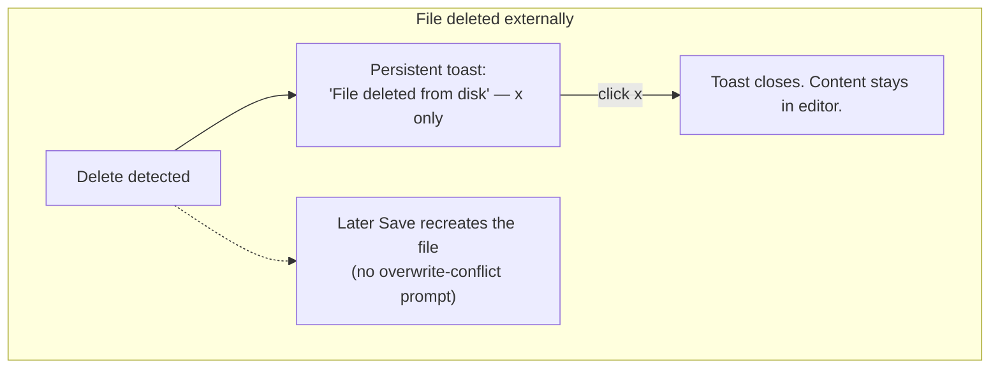

# Auto-reload on disk change

## Idea

We've already worked on how to reload information from the disk when the AI changes something so that the preview edit mode updates by clicking on the reload button. What I want now is, I wonder if we can add functionality that, if there are no changes in the documents (so if I haven't made any changes to the doc that are unsaved), then if the document in the disk changes, the document in the preview edit should change automatically. Maybe with a little toast at the bottom of the page saying it has changed and it has been updated.

I think that we should use a sem toast for when there is something that has been changed in the document by the user, and then the document in the disk changes. That toast should appear and should say, "The disk document has changed. Do you want to reload?" or something like that.

## Brainstorm

**Note:** research during brainstorming found that auto-reload-on-clean-disk-change and
a "reload?" prompt-on-dirty already exist in the codebase (`mdEditorProvider.ts` file
watcher + `mdWebview.ts` `diskChangedExternally` handler). This brainstorm refines/unifies
that existing behavior rather than designing it from scratch.

### Decided direction

One unified rule across save/reload, instead of ad-hoc per-button logic: **no
disk↔editor sync ever happens silently** when it could lose something, and any
disk-changed notification is a persistent, user-driven toast rather than a
timed one.

- **External disk change (file-system watcher):** always show a persistent
  bottom toast — *"File changed on disk"* with a **Reload** action and an
  explicit **×** dismiss button. It never auto-dismisses on a timer, and
  nothing is applied without a click.
  - Click **Reload** while there are unsaved local edits → discard-confirmation
    modal ("Discard unsaved changes and reload from disk?") appears first;
    confirming applies the disk content, cancelling returns to the toast.
  - Click **Reload** while clean (no unsaved edits) → applies immediately, no
    modal (nothing to lose).
  - Click **×** → toast closes, nothing is applied. The fact that disk has
    diverged is still remembered for the Save check below (dismissing the
    toast does not waive it).
  - If disk changes again while the toast is already showing and un-acted-on →
    silently update the pending content behind the toast; the toast itself
    doesn't change, so Reload always applies whatever is latest when clicked.
- **Manual reload button:** stays a direct, explicit action — it does **not**
  route through the toast. Clicking it goes straight to the discard-confirm
  modal if dirty, or applies immediately if clean. (Matches existing
  `reloadFromDiskButton` behavior already; no change needed there.)
- **Manual save:** if disk hasn't changed since the editor's last known
  baseline, Save just writes, no prompt (common case). If disk *has* changed
  externally since that baseline — i.e. saving now would silently clobber an
  external edit — show an overwrite-conflict confirmation before writing. This
  check is independent of whether the external-change toast was shown or
  dismissed.
- Short, non-actionable acknowledgement toasts ("Saved", "Reloaded from disk"
  after a successful apply) keep their existing brief auto-dismiss timer —
  only the *actionable* "file changed on disk" toast becomes
  persistent-until-dismissed.

### Flow

```mermaid
flowchart TD
    subgraph AB["External disk change (file watcher)"]
        A1[Disk change detected] --> A2["Persistent toast:<br/>'File changed on disk' — Reload / x"]
        A2 -->|"disk changes again<br/>before user acts"| A2n[Silently update pending<br/>content behind the toast]
        A2n --> A2
        A2 -->|"click x"| A3["Toast closes, no apply.<br/>Divergence still remembered for Save check"]
        A2 -->|"click Reload"| A4{Unsaved local edits?}
        A4 -->|No| A5[Apply disk content immediately]
        A4 -->|Yes| A7["Discard-confirm modal:<br/>'Discard unsaved changes and reload?'"]
        A7 -->|Cancel| A2
        A7 -->|Confirm| A5
        A5 --> A6["Brief 'Reloaded from disk' toast<br/>(auto-dismiss, as today)"]
    end

    subgraph C["Manual reload button (direct action, skips toast)"]
        C1[User clicks reload button] --> C2{Unsaved local edits?}
        C2 -->|No| C3[Apply disk content immediately]
        C2 -->|Yes| C4["Discard-confirm modal:<br/>'Discard unsaved changes and reload?'"]
        C4 -->|Cancel| C5[No change]
        C4 -->|Confirm| C3
        C3 --> C6["Brief 'Reloaded from disk' toast"]
    end

    subgraph D["Manual save (Cmd+S / Save button)"]
        D1[User saves] --> D2{Disk changed since<br/>editor's last known baseline?}
        D2 -->|No| D3[Write to disk]
        D2 -->|Yes| D5["Overwrite-conflict confirmation:<br/>'File changed on disk since you<br/>opened it — overwrite anyway?'"]
        D5 -->|Cancel| D6[Save aborted, local edits kept]
        D5 -->|Confirm| D3
        D3 --> D4["Brief 'Saved' toast"]
    end
```

### Additional scope: autosave, file deletion, race hardening

All three confirmed in scope for this idea.

**Autosave for Markdown** (doesn't exist today):

- New setting `xlsxViewer.markdown.autoSave` (boolean), default **`false`** —
  mirrors XLSX's cautious opt-in default (prose documents, like structured
  XLSX data, warrant an explicit opt-in) rather than CSV/TSV's default-on.
- When enabled, saves fire after a short debounce following the last edit
  (same "short debounce" language as the existing CSV/TSV setting
  descriptions).
- Autosave defers while there's an unresolved external-disk-conflict (the
  persistent "file changed on disk" toast is still showing) — it never fires
  an automatic overwrite over an unresolved conflict. It resumes once the
  user reloads or manually confirms the overwrite via the Save conflict
  dialog.

**File deleted externally** (watcher today only listens for `onDidChange`):

- Watcher also listens for `onDidDelete`.
- Shows a persistent toast — *"File deleted from disk"* — informational
  only, dismiss (×) only, no Reload action (nothing to reload). The user's
  content stays safe in the editor.
- A later Save just recreates the file at that path; this is **not** treated
  as an overwrite conflict (there's no content on disk to lose).
- Edge case for Plan to verify: if the file reappears later with different
  content, does the watcher's `onDidChange` still fire on recreation, so the
  normal A/B flow picks it up?

**Save/watcher race hardening:**

- Adopt the same guard the spreadsheet watcher already uses: skip the
  watcher's `onDidChange` handler if `isSaving` is true **or** less than
  ~1s has passed since our own last save (time-based `lastSaveTime` check),
  not just the `isSaving` flag alone.

## Plan

Full plan drafted and approved in Plan mode; condensed here.

**Message protocol additions:** `diskDeletedExternally` (host to webview, watcher
`onDidDelete`), `saveConflict` (host to webview, host's own fresh-read-before-write
caught a disk change the webview didn't know about yet), `saveMarkdown` gains
`force`/`isAutosave` fields, `updateSettings`/`initSettings`/`settingsUpdated`
gain `autoSave` in the generic `settings` payload.

1. **Toast component** (`showToast()` in `mdWebview.ts` + `.toast-notification` in
   `mdWebview.css`): add `persistent`/`onDismiss` options and an explicit close
   (`x`) button; reposition every toast from center-screen to bottom-center.
2. **Unify external disk-change handling**: `diskChangedExternally` always sets
   `pendingDiskContent` and shows a persistent toast (Reload / x) for
   unprompted watcher-detected changes; an explicit manual-reload request or
   reading mode applies directly, bypassing the toast. Dirty/clean only
   branches inside the Reload click (discard-confirm modal vs. immediate apply).
3. **File deleted externally**: host watcher adds `onDidDelete` ->
   `diskDeletedExternally`; webview tracks `pendingDiskDeleted`, shows an
   informational persistent toast with no action (nothing to reload); a
   later save just recreates the file (not treated as a conflict).
4. **Manual reload button**: no behavior change (already matches the rule).
5. **Save-vs-disk conflict guard**: client-side primary check on
   `pendingDiskContent` in `performSave()` (shows `confirmOverwriteConflict()`
   modal before overwriting); host-side fallback in `saveMarkdown` does a
   fresh disk read compared to its tracked `currentContent` baseline and
   responds with `saveConflict` instead of writing if they differ (covers the
   narrow race where the client doesn't know yet). `force: true` bypasses the
   host check after an explicit user confirmation.
6. **Save/watcher race hardening**: host tracks `lastSaveTime`; watcher's
   `onDidChange` guard becomes `isSaving || Date.now() - lastSaveTime < 1000`
   (mirrors the spreadsheet provider's existing pattern).
7. **Markdown autosave**: new `xlsxViewer.md.autoSave` setting (default
   `false`); webview debounces (1200ms) off the CM6 `onDocChanged` callback,
   skips silently (no dialog) if there's an unresolved `pendingDiskContent`
   conflict, and shows "Autosaved"/"Autosave failed" instead of "Saved"/"Error
   saving".
8. **Docs**: update `.docs/MESSAGE-PROTOCOL.md` with the new/changed messages;
   opportunistically fix two pre-existing drifts found during research
   (`toggleView` dead code, `initMarkdown` field name).

Files touched: `src/mdEditorProvider.ts`, `src/webviews/md/mdWebview.ts`,
`resources/md/mdWebview.css`, `package.json`, `.docs/MESSAGE-PROTOCOL.md`.

## Implementation Log

Implemented as planned, in one continuous pass (Plan approved, then
implemented immediately per user direction — no separate stop between Plan
and Implement this round).

- `src/webviews/md/mdWebview.ts`: extended `showToast()` with `persistent`/
  `onDismiss` + a close button (`hideToast()` helper added); rewrote the
  `diskChangedExternally` handler per the unified rule; added
  `pendingDiskDeleted` state + `diskDeletedExternally` handler; refactored
  `confirmDiscardAndReload()`'s modal markup into a shared `confirmModal()`
  helper and added `confirmOverwriteConflict()` on top of it; split
  `performSave()`/`doSave()` with the `pendingDiskContent` conflict guard and
  `isAutosave` threading; added `scheduleAutosave()` wired off the CM6
  `onDocChanged` callback; added `chkAutoSave` settings-panel checkbox; added
  `case 'saveConflict'` (skips the confirm dialog silently when
  `lastSaveWasAutosave` is true, so autosave never interrupts — a small
  addition beyond the literal plan text needed to fully satisfy "autosave
  never interrupts" against the host-side fallback path too).
- `src/mdEditorProvider.ts`: added `lastSaveTime`; watcher gained a second
  `onDidDelete` listener (disposed alongside the existing one); `saveMarkdown`
  handler gained the fresh-read-vs-`currentContent` conflict check (skipped
  when `force`), `saveConflict` response, and now echoes `isAutosave` back on
  `saveResult`; `restoreVersion` also updates `lastSaveTime`; all three
  settings-payload construction sites and `updateSettings` gained `autoSave`.
- `resources/md/mdWebview.css`: `.toast-notification` repositioned from
  center-screen to bottom-center; added `.toast-close` styling.
- `package.json`: added `xlsxViewer.md.autoSave` (boolean, default `false`).
- `.docs/MESSAGE-PROTOCOL.md`: added the new/changed messages; fixed the
  `toggleView` (dead) and `initMarkdown` (`content` not `text`) drift noted
  during brainstorming.
- Verification: `npm run compile` (type-check + lint + bundle) passes with 0
  errors. No automated test suite exists for this repo per `CLAUDE.md` — QA
  phase will need a manual smoke test.

## QA

**Build:** `npm run compile` — pass (0 type + 0 lint errors, 2026-08-13).

**Static verification (code + manifest):**

| Check | Result |
|---|---|
| Persistent toast with Reload / × on `diskChangedExternally` | Pass |
| `diskDeletedExternally` handler + informational persistent toast | Pass |
| Save overwrite-conflict guard (`pendingDiskContent` + host `saveConflict`) | Pass |
| `xlsxViewer.md.autoSave` setting (default `false`) in `package.json` | Pass |
| Autosave debounce + defer while conflict toast active | Pass |
| Watcher race guard (`isSaving` + `lastSaveTime` 1s window) | Pass |
| Toast repositioned bottom-center with close button | Pass |
| `.docs/MESSAGE-PROTOCOL.md` updated | Pass |

**Manual F5 spot-check recommended:** edit `samples/test.md` externally while editor is open (clean vs dirty) → persistent toast + Reload/discard flow; enable autosave in settings and confirm debounced save; delete file externally and confirm informational toast.
