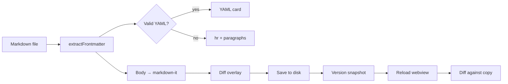

# Heading 1 — copy diff test

This is the **copy** of `test.md`, edited for diff overlay testing. Changes here should highlight against the original.

## Heading 2 — copy variant

### Heading 3 — mid-tree edit

#### Heading 4 — deepest level edited


**Hello**

- First bullet with real text
- Second bullet for list preview
- Third bullet to exercise wrapping in narrow panes
- Fourth bullet added in round three
- Fifth bullet — round five

## Hello (capitalized) — v2

- Nested spacing test
- Another item with consistent indentation
- Round four list item
- Round six list item
- Copy-only bullet — not in test.md

`inline-code-sample-v3`

Plain paragraph with **bold**, *italic*, ***bold italic***, ~~strikethrough~~, and `inline code`.

A second paragraph to pad scroll height. This copy uses different wording so the diff engine has something to compare.

A [link](https://example.com), a [second link](https://github.com), a [third link](https://cursor.com), and a bare URL [https://example.com](https://example.com).

> Blockquote line one — copy edition.
> Blockquote line two — simplified for diff clarity.
>
> Blockquote with a third paragraph — cleaned up from duplicate lines.

Unordered list:

- Item one with corrected spelling
- Item two (renamed from "hey")
- Item three (renamed from "threedfsds")
- Item four
  - Nested item
  - Another nested item with longer text that may wrap in narrow panes
- Item five (was duplicate "Item three")
- Item six — round six addition
- Item seven — copy-only addition

Ordered list:

1. First
2. Second (typo fixed)
    3. Nested step
3. Third
4. Fourth item added for length
5. Fifth item — new for diff testing
6. Sixth item — round three addition
7. Seventh item — round five
8. Eighth item — round six
9. Ninth item — copy diff only

Task list:

- [x] Done task
- [x] Previously open — now checked off
- [x] Second open task — checked off in round four
- [x] Round five task — freshly added
- [x] New unchecked task — checked in round six
- [ ] Round six task — open
- [ ] Copy diff task — newly added

::: info
Info callout — tests the markdown-it container plugin. Round six refresh.
:::

::: warning
Warning callout with **bold** and `code` inside. Round five appended this note.
:::

::: tip
New tip callout added in the second round of edits. Round three adds this trailing sentence.
:::

::: danger
Danger callout — round three addition for diff coverage. Escalated in round six.
:::

::: note
Note callout — brand new in round six. Copy file extends this sentence.
:::

Horizontal rule (mid-document — must NOT be treated as YAML frontmatter):

---

Second horizontal rule immediately after the first:

---

Code blocks:

```js
function add(a, b) {
  return a + b;
}

function multiply(a, b) {
  return a * b;
}

function divide(a, b) {
  if (b === 0) throw new Error('Division by zero');
  return a / b;
}

function subtract(a, b) {
  return a - b;
}

// Extra lines so the fence block spans multiple source lines
console.log(add(2, 3));
console.log(subtract(5, 2));
console.log(multiply(4, 5));
console.log(divide(10, 2));
```

```python
def greet(name: str) -> str:
    return f"Hello, {name}!"

def farewell(name: str) -> str:
    return f"Goodbye, {name}!"

for person in ["Alice", "Bob", "Carol", "Dan", "Eve", "Frank"]:
    print(greet(person))
    print(farewell(person))
```

## Tables

Simple two-column table:

| Header 1 | Header 2                               | Header 3 |
| -------- | -------------------------------------- | -------- |
| Cell 1   | Cell 2 with cleaned-up text for readability | Cell 3   |
| Row 2 A  | Row 2 B with enough text to force wrapping when the preview pane is narrow | Row 2 C |
| Row 3 A  | Row 3 B — updated in round three         | Row 3 C  |
| Row 4 A  | Row 4 B — brand new row                    | Row 4 C  |
| Row 5 A  | Row 5 B — round five row                   | Row 5 C  |
| Row 6 A  | Row 6 B — round six row                    | Row 6 C  |
| Row 7 A  | Row 7 B — copy-only row                    | Row 7 C  |

Team roster (more rows, mixed content):

| Name  | Role            | Active | Notes |
| ----- | --------------- | ------ | ----- |
| Alice | Engineer | true   | Primary maintainer; owns markdown preview and CM6 live edit. |
| Bob   | Designer   | false  | UI polish, toolbar icons, theme tokens. |
| Carol | QA         | true   | Smoke tests F5 samples after each change. |
| Dan   | Docs       | true   | Keeps MESSAGE-PROTOCOL.md in sync with handlers. |
| Eve   | Infra      | false  | esbuild bundle paths and CSP localResourceRoots. |
| Frank | DevOps     | true   | CI pipelines and release automation. |
| Grace | PM         | true   | Roadmap and sample file maintenance. |
| Henry | Support    | false  | User feedback triage — added round five. |
| Iris  | Security   | true   | CSP and localResourceRoots audits — round six. |
| Jake  | Copy Editor| true   | Maintains test copy.md for diff testing. |

Wide feature matrix (long cells, many columns):

| Feature | Preview | Preview Edit | Split | Notes |
| ------- | ------- | ------------ | ----- | ----- |
| YAML frontmatter card | Yes | Yes (click field → jump to source) | Inherits preview pane | Doc-start `---` only |
| Tables | Rendered | CM6 table widget | Both panes | Resize columns persist per file |
| Task lists | Checkbox UI | Toggle dispatches doc change | — | See task list above |
| Mermaid | Below | Rendered when not editing fence | — | Requires reload after edit |
| Search in preview | Overlay | CM6 search | — | Case sensitivity setting |
| Version history | Panel | — | — | Snapshots on save |

Alignment and numeric columns:

| Left aligned | Center aligned | Right aligned | Qty |
| :----------- | :------------: | ------------: | --: |
| Alpha        | Beta           | Gamma         | 1   |
| Longer left column text that should wrap gracefully in a narrow editor | Mid | 99.50 | 42 |
| Delta        | Epsilon        | Zeta          | 100 |
| Omega        | Pi             | Tau           | 256 |
| Sigma        | Rho            | Phi           | 512 |

## Mermaid



## Definition list

Term one
: Definition for term one spanning a couple of clauses so it is not a single short line.

Term two
: Second definition with **emphasis** and a [link](https://example.com).

Term three
: Third term added in round three — tests definition list diffs.

Term four
: Fourth definition — round five addition with ~~removed text~~ and `code`.

Term five
: Fifth term — round six. Includes ***bold italic*** markup.

Term six
: Sixth term — copy file only. Compare with `test.md` Term five.

## Images


Missing image (should show an error placeholder):


## Footnotes

Footnote reference[^1], a second reference[^2], a third reference[^3], and a fourth[^4].

[^1]: Footnote text goes here. Add extra sentences so the footnote block occupies more vertical space in the preview footer area.
[^2]: Second footnote with `inline code` and **bold** for renderer coverage.
[^3]: Third footnote — round three addition for diff testing.
[^4]: Fourth footnote — round five. References the [project repo](https://github.com).

## Line breaks

Line break test:
This line ends with two trailing spaces.  
This is on a new line — round six edit.

This paragraph uses a manual line break in source  
and another one here  
to build a taller block without extra blank lines.

## Extra section for scroll spy

### Subsection A

Content under subsection A. Scroll the preview and watch the TOC highlight track this heading. Round five refresh.

### Subsection B

Content under subsection B. Enough filler to make scrolling meaningful when testing sync between editor and preview panes. Round four tweak.

### Subsection D

New subsection added in round four for TOC diff testing. Extended in round six.

### Subsection E

Subsection E — inserted in round six between D and C.

### Subsection C

Final subsection. End of `samples/test copy.md` — diff test document.

## Diff test section (copy edition)

This section tracks edits made to **test copy.md** for diff overlay testing against `test.md`.

| Change type | Example |
| ----------- | ------- |
| Modified    | Title, status → draft, intro rewritten |
| Added       | Jake row, Term six, Row 7, copy-only bullets |
| Removed     | Gibberish (fskhfads, dsjfbsj), duplicate blockquotes |
| Fixed       | "pellingspelling" → "spelling", Item five/f six labels |
| Copy-only   | Frank in Python loop, mermaid Diff node, ninth ordered item |
