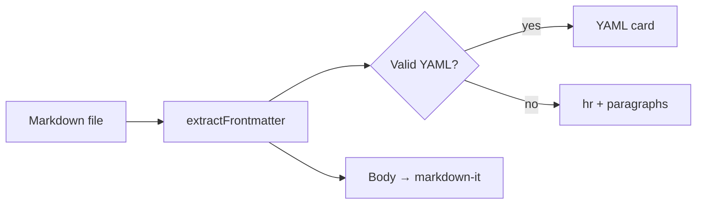

# Heading 1

## Heading 2

### Heading 3

#### Heading 4


**Hello**
- snfakjdnfs
- aksdnfkasdnfas
- adsfnsakdfnsa

## hello
- ksnafkds
-     efsdfs

`jbnjbd`

Plain paragraph with **bold**, *italic*, ***bold italic***, ~~strikethrough~~, and `inline code`. Plain paragraph with **bold**, *italic*, ***bold italic***, ~~strikethrough~~, and `inline code`. Plain paragraph with **bold**, *italic*, ***bold italic***, ~~strikethrough~~, and `inline code`. Plain paragraph with **bold**, *italic*, ***bold italic***, ~~strikethrough~~, and `inline code`. Plain paragraph with **bold**, *italic*, ***bold italic***, ~~strikethrough~~, and `inline code`.

A second paragraph to pad scroll height. Lorem ipsum dolor sit amet, consectetur adipiscing elit. Sed do eiusmod tempor incididunt ut labore et dolore magna aliqua. Ut enim ad minim veniam, quis nostrud exercitation ullamco laboris.

A [link](https://example.com) and a bare URL [https://example.com](https://example.com).

> Blockquote line one.
> Blockquote line two.
>
> Blockquote with a sdsdsthird paragraph for height.

Unordered list:
Missspellled workd

asdfasdfas
dsfd
- Item one fasfdsavs helpp hey
- hey
- threedfsds
- Item two
  - Nested item
  - Another nested item with longer text that may wrap in narrow panes
- Item three

Ordered list:

1. First
2. Secondsdss
    3. Nested step
3. Third
4. Fourth item added for length

Task list:

- [x] Done task
- [ ] Open task
- [ ] Second open task with a longer label to test wrapping in the checkbox row

::: info
Info callout — tests the markdown-it container plugin.
:::

::: warning
Warning callout with **bold** and `code` inside.
:::

Horizontal rule (mid-document — must NOT be treated as YAML frontmatter):

---

Second horizontal rule immediately after the first:

---

Code blocks:

```js
function add(a, b) {
  return a + b;
}

// Extra lines so the fence block spans multiple source lines
console.log(add(2, 3));
```

```python
def greet(name: str) -> str:
    return f"Hello, {name}!"

for person in ["Alice", "Bob", "Carol"]:
    print(greet(person))
```

## Tables

Simple two-column table:

| Header 1 | Header 2                               | Header 3 |
| -------- | -------------------------------------- | -------- |
| Cell 1   | Cell 2 dfkinaksenfiasndfidnsadifasfdsa | Cell 3   |
| Row 2 A  | Row 2 B with enough text to force wrapping when the preview pane is narrow | Row 2 C |
| Row 3 A  | Row 3 B                                | Row 3 C  |

Team roster (more rows, mixed content):

| Name  | Role            | Active | Notes |
| ----- | --------------- | ------ | ----- |
| Alice | Engineerdjbsjbd | true   | Primary maintainer; owns markdown preview and CM6 live edit. |
| Bob   | Designer        | false  | UI polish, toolbar icons, theme tokens. |
| Carol | QA              | true   | Smoke tests F5 samples after each change. |
| Dan   | Docs            | true   | Keeps MESSAGE-PROTOCOL.md in sync with handlers. |
| Eve   | Infra           | false  | esbuild bundle paths and CSP localResourceRoots. |

Wide feature matrix (long cells, many columns):

| Feature | Preview | Preview Edit | Split | Notes |
| ------- | ------- | ------------ | ----- | ----- |
| YAML frontmatter card | Yes | Yes (click field → jump to source) | Inherits preview pane | Doc-start `---` only |
| Tables | Rendered | CM6 table widget | Both panes | Resize columns persist per file |
| Task lists | Checkbox UI | Toggle dispatches doc change | — | See task list above |
| Mermaid | Below | Rendered when not editing fence | — | Requires reload after edit |
| Search in preview | Overlay | CM6 search | — | Case sensitivity setting |
| TOC / outline | Side panel | Built from headings | — | Headings below frontmatter |

Alignment and numeric columns:

| Left aligned | Center aligned | Right aligned | Qty |
| :----------- | :------------: | ------------: | --: |
| Alpha        | Beta           | Gamma         | 1   |
| Longer left column text that should wrap gracefully in a narrow editor | Mid | 99.50 | 42 |
| Delta        | Epsilon        | Zeta          | 100 |

## Mermaid



## Definition list

Term one
: Definition for term one spanning a couple of clauses so it is not a single short line.

Term two
: Second definition with **emphasis** and a [link](https://example.com).dsfsdfsd

## Images


Missing image (should show an error placeholder):


## Footnotes

Footnote reference[^1] and a second reference[^2].

[^1]: Footnote text goes here. Add extra sentences so the footnote block occupies more vertical space in the preview footer area.
[^2]: Second footnote with `inline code` and **bold** for renderer coverage.

## Line breaks

Line break test:
This line ends with two trailing spaces.  
This is on a new line.

This paragraph uses a manual line break in source  
and another one here  
to build a taller block without extra blank lines.

## Extra section for scroll spy

### Subsection A

Content under subsection A. Scroll the preview and watch the TOC highlight track this heading.

### Subsection B

Content under subsection B. Enough filler to make scrolling meaningful when testing sync between editor and preview panes.

### Subsection C

Final subsection. End of `samples/test.md` test document.
